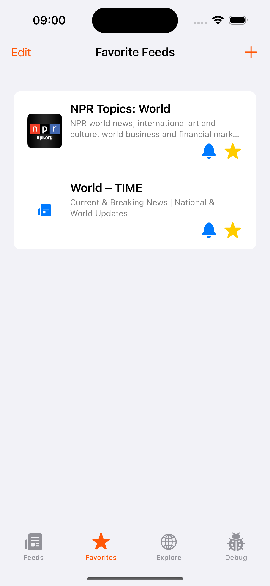

# RSS Reader

An iOS application for reading and managing RSS feeds, a project that follows a modular architecture using a Swift Package core with clean architecture principles.
Built with Swift and SwiftUI, using MVVM for handling logic within the packages modules. 

## Screenshots

  
  
  

  <em>Left: Main feed list with all RSS feeds - Middle: Edit mode for deleting feeds(also simple swipe to delete) - Right: Add new feed screen with example options (Explore could be reused here)</em>

  
  
  

  <em>Left: Favorites tab showing starred feeds - Middle: Explore tab with suggested feeds to add(from local JSON) - Right: Debug panel for testing notifications and background tasks</em>

## Assignment Requirements

### Core Requirements ✅
- ✅ Add RSS feeds by specifying an RSS feed URL
- ✅ Remove RSS feeds 
- ✅ View added RSS feeds with name, image (if available), and description
- ✅ Select a feed to view its items with image (if available), title, and description
- ✅ Open feed items in the device browser (webview branch is not finished, also not really nice with the webviews not optimised)

### Optional Requirements ✅
- ✅ Add RSS feeds to Favorites
- ✅ Additional functionality: Explore tab with suggested feeds (loaded from a local JSON file) for more convenient adding the feeds
- ✅ Debug tab and view for testing notifications and background tasks (can be switched to Settings tab)

### Optional Requirements still in progress
- ✅ Turn on notifications for new feed items for subscribed RSS feeds
- Background task logic for fetching new items is still buggy and needs improvement
- Currently it works by using the debug meenu option to trigger the task manually, shows notifications for new articles in the subscribed feeds

### Potential Improvements
- Raise coverage to 80% (currently at ca 64%) and maintain it
- Handling background tasks better (maybe creating a proper modern async wrapper), current solution is still buggy
- Deep linking from the notifications to the articles
- Enable opening feed items in webview and disabling navigation within
- Switching between webview and safari in a settings tab
- Displaying top 5 or 10 feeds which are not already in the feeds list from explore in add view 
- Finish enabling the PR templates for feature, bugfix, task and release branches
- Handle HTML in feed articles (and reuse the KFImage wrapper or create a simple cache - but I'm pro battle tested solutions)
- Consider pagination for the news items
- Retrying setting up CI (current max Xcode version in Github Actions runners is 15.4, requires a lot of compromising)
- Use Codecov or similar to handle coverage and add it as part of pipelines
- Use Sonarqube or similar to handle code quality
- Use tuist for project and resources generation
- Use POEditor or similar for localization
- Handle scroll to top and navigation path resetting for iOS17
- Add crash and non fatals tracking tool
- Use a standardized state enum pattern, maybe a generic ViewState<T>
- Separate UI elements from the Common module into SharedUI or similar
- Add a styleguide module, containing fonts, colors, font styles, button styles etc
- Add a schema migration strategy for SwiftData to handle future model changes
- Standardize dependency injection approach across the codebase
- Implement feed refresh indicators and pull-to-refresh functionality
- Add feed search/filtering capability within the app
- Create a reading history feature to track read/unread items
- Add dark mode theme optimization (or improve design in general as it is pretty basic right now)
- Create widget extensions for quick access to favorite feeds
- Add share sheet extension for adding feeds from websites
- Support for importing/exporting OPML feed lists
 

## Architecture

This project uses a clean architecture approach with the following components:

- **RSSReaderKit**: Swift Package containing all the core modules
- **RSSClient**: Core module for fetching and parsing RSS feeds
- **SharedModels**: Common models used across modules
- **PersistenceClient**: SwiftData-based persistence layer
- **NotificationClient**: Handles notification permissions and delivery
- **Common**: Reusable UI components and utilities
- **FeedListFeature**: UI components for displaying and managing feeds
- **FeedItemsFeature**: UI for displaying feed items
- **ExploreFeature**: Discovery interface for finding new feeds
- **TabBarFeature**: Main navigation structure

The project implements:
- Dependency injection using swift-dependencies
- Swift Concurrency with async/await
- Protocol-oriented programming for testability
- SwiftUI with the Observation framework
- Comprehensive test coverage with snapshot tests and unit tests
- SwiftData for persistent storage
- Background notifications for feed updates

## Getting Started

### Requirements
- iOS 17+
- Swift 6+
- Xcode 16+

### Installation

1. Clone the repository
2. Open the project in Xcode
3. Build and run

Makefile can be leverage as well: `make project`

### Development Tools

The project includes a Makefile with various commands to simplify development, and can be used to run them locally, like swiftlint and swiftformat.

