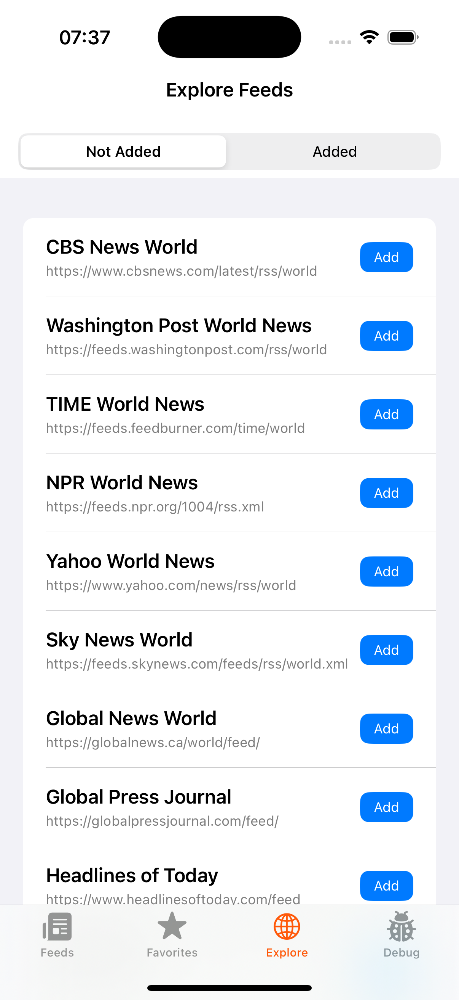

# RSS Reader


An iOS application for reading and managing RSS feeds, built with a focus on clean architecture, testability, and modern iOS development practices. The project is structured as a modular Swift Package with clear separation of concerns.

## Features

- Add, remove and manage RSS feeds 
- View feed items with rich content support (images, descriptions)
- Background refresh and notifications for new items
- Favorite feeds management
- Explore curated feed suggestions
- Enhanced feed addition with top recommendations
- Debug panel for notifications and background tasks
- SwiftData persistence
- Comprehensive test coverage
- Clean, modular architecture

## Screenshots

<p align="center">
  
  
  
</p>
<p align="center">
  <em>Left: Main feed list with all RSS feeds - Middle: Empty feeds view - Right: Add new feed screen with suggested feeds</em>
</p>
<p align="center">
  
  
  
</p>
<p align="center">
  <em>Left: Favorites tab with starred feeds - Middle: Empty favorites view - Right: Feed items view showing article content</em>
</p>

<p align="center">
  
  
</p>
<p align="center">
  <em>Left: Explore tab with suggested feeds to add - Right: Debug panel for testing notifications and background tasks</em>
</p>

## Dependencies

### Core Dependencies
- **[swift-dependencies](https://github.com/pointfreeco/swift-dependencies)**: Dependency management
- **[swift-concurrency-extras](https://github.com/pointfreeco/swift-concurrency-extras)**: Utilities for concurrent code
- **[swift-snapshot-testing](https://github.com/pointfreeco/swift-snapshot-testing)**: Snapshot testing framework
- **[Kingfisher](https://github.com/onevcat/Kingfisher)**: Image downloading and caching

### Development Tools
- **[SwiftLint](https://github.com/realm/SwiftLint)**: Code style and conventions enforcement
- **[swift-format](https://github.com/apple/swift-format)**: Code formatting

## Architecture

### Core Components

The project is built as a Swift Package (RSSReaderKit) containing multiple modules:

#### Features
- **FeedListFeature**: Main feed management UI
- **FeedItemsFeature**: Feed items display
- **ExploreFeature**: Feed discovery interface
- **TabBarFeature**: Main navigation structure

#### Repositories
- **FeedRepository**: Handles feed related logic, fetching, parsing and persisting them locally
- **NotificationRepository**: Handles notifications and background refresh coordination

#### Core Services
- **RSSClient**: RSS feed fetching and parsing
- **PersistenceClient**: SwiftData-based storage
- **BackgroundRefreshClient**: Background task scheduling and execution
- **UserNotificationClient**: System notification handling
- **UserDefaultsClient**: UserDefaults interaction

#### Support
- **Common**: Utilities, and constants
- **SharedModels**: Data models used across modules
- **SharedUI**: Shared UI components

### Key Technical Aspects

- **Dependency Injection**: Using [Point-Free's Dependencies](https://github.com/pointfreeco/swift-dependencies)
- **Modern Concurrency**: Leveraging async/await and actors
- **Repository Pattern**: Abstracting data sources behind clean interfaces
- **SwiftUI**: Modern declarative UI with Observation framework
- **Testing**: Comprehensive unit and snapshot tests
- **SwiftData**: Native persistence with modern Swift data modeling

## Development

### Requirements
- iOS 17+
- Swift 6+
- Xcode 16+

### Getting Started

1. Clone the repository
2. Run `make project` to initialize dependencies
3. Open `RSSReader.xcodeproj`
4. Build and run

### Makefile Commands

The project includes a comprehensive Makefile for development tasks:

```bash
make project         # Runs install-tools, setup and open
make renew           # Runs xcode-clean, clean, reset-packages, project
make setup           # Initial project setup
make open            # Open project in Xcode
make init-packages   # Initialize local package dependencies
make reset-packages  # Reset package caches
make lint            # Run SwiftLint
make lint-fix        # Fix SwiftLint violations
make format          # Run swift-format
make clean           # Clean build artifacts
make install-tools   # Install required development tools
```

## Potential Improvements

### Technical Enhancements
- Increase test coverage to 80%
- Optimize background task handling
- Add direct deep linking to articles
- Implement in-app webview with proper navigation
- Add settings for webview/Safari preference
- Implement HTML content handling
- Add pagination for feed items
- Set up CI/CD pipeline
- Implement code coverage reporting
- Add code quality metrics

### Feature Additions
- Reading history tracking
- Feed search and filtering
- Dark mode optimization
- Widget extensions
- Share sheet integration
- OPML import/export
- Pull-to-refresh
- Unread item tracking

### Architecture & Development
- Standardize state management
- Split UI components into dedicated module
- Add style guide system
- Implement SwiftData migration strategy
- Add crash reporting
- Improve localization support

## Getting Help

For any questions please contact me via martino.mamich@gmail.com.

Check the debug tab in the app for testing notifications and background tasks. The app includes comprehensive logging and debugging tools for development.

## License

This project is licensed under the MIT License - see the [LICENSE](LICENSE) file for details.

Copyright (c) 2025 Martino Mamić
